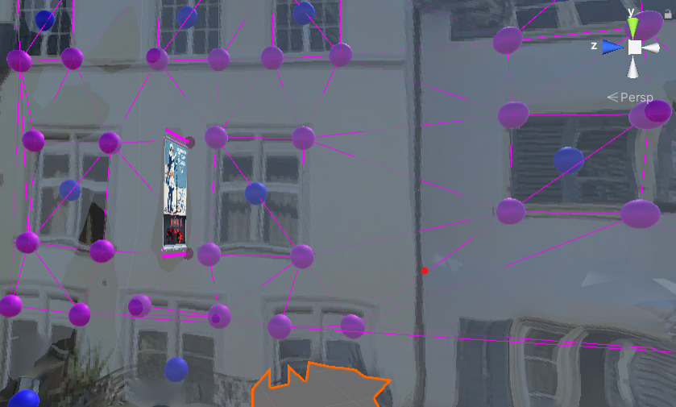

# Fast Content Placement in 3D Scenes with Unity
Fast placement with plane detection based snapping

Auto placement based on semantic markers (windows) and triangulation

## The Project
- Making placement and alignment of (2d) content in 3d scenes easier and faster with the use of plane detection. By applying plane detection to the scene and finding planes for walls and other regions, 2d content (or content with a 2d reference plane) can be aligned and position to those found planes. By selection a location on a plane (e.g. the wall), content can be placed leaving only one axis of the content that might have to be changed. 
- Initial placement suggestions through different criteria:
    - Range for x-,y-,z- axis
    - Field of view
    - Semantic criteria:
        - window detection and triangulation on 2d plane to calculate the placement of content relative to objects (windows)

## First Time Setup
Open the project with Unity 2020.3.19
Install the following packages in the Unity Package Manager:
**arfoundation 4.2.0, arcore xr plugin 4.2.0, arkit xr plugin 4.2.0**

## Software and Packages
3d reconstruction of the scene with https://immersal.com/

Plane detection with Microsoft's PlaneFinding https://github.com/microsoft/MixedRealityToolkit/tree/main/SpatialMapping/PlaneFinding/

Window detection with https://github.com/lck1201/win_det_heatmaps . Key points are detected on the textures and mapped into the 3d space.

Triangulation with https://github.com/egomeh/unity-delaunay-triangulation

## Scenes
Load `Assets/Scenes/RobinScenes/ImmersalTestScene.unity` to run the app and see a working setup. Necessary scripts are attached to the `Managers` and the `Ar Camera` GameObjects.

## Important Scripts and Methods
All Scripts can be found in `Assets/Scripts/`. The parent directory `Assets/Scripts/` will be omitted in this section.

### ContentPlacement.cs
Enables placement of content. First click the plus symbol to select an object, then left-click onto a plane to place it or move it. Use right-click to turn the camera. 
- `AutoPlace()`: Moves object to the best location that can be found by sampling points through RayCasts from the user's field of view. 
- `PlaceOrMove(RaycastHit hit)`: Moves object to the location of the RaycastHit or creates a new object at that location if none is selected. 

### PlacementCriteria
- `PlacementCriterion.cs`: Parent class for all criteria. Subclasses implement the `Score(RaycastHit hit)` or the `Score(RaycastHit hit, MyTriangulation triangulation)` method to return a scor between `0f` (bad location) and `1f` (good location) of the point stored in the RaycastHit.  
- `PositionCriterion.cs`: Set a range for each axis of possible locations. Score return `0` if a location is not within the range (otherwise `1`).
- `CenterCriterion.cs`: Everything in the center of the field of view of the user gets a score of `1`. The further away from the center, the lower the score.
- `WindowsCriterion.cs`: Decide if objects should be placed within or between windows. **Attention**: Many parts of this criterion are not implemented yet. So far, only the center point of an object is considered (`Bounds` mode is not working yet).

### MyPlanes.cs
Calculates planes for the scene. 
- `public float planeCalcScaleFactor`: Adjust the granularity of the plane detection. Small values (<1) -> detect more (and smaller) planes.

### UvTo3dWorldPositionMapper.cs
Maps features (like windows) found in the textures to the 3d scene. **Attention**: Many feature points currently fail to be mapped -> debug.
- `CreateMarker(...)`: Creates a marker for a specified feature point. It is visualized with a Sphere object and information (like a id and type) is encoded using a `Marker` component. 

## future work
- Better integrate our tool into Unity
- More semantic criteria
- Support for 3d objects (not only on walls)
- Analyze/create objects themselves
